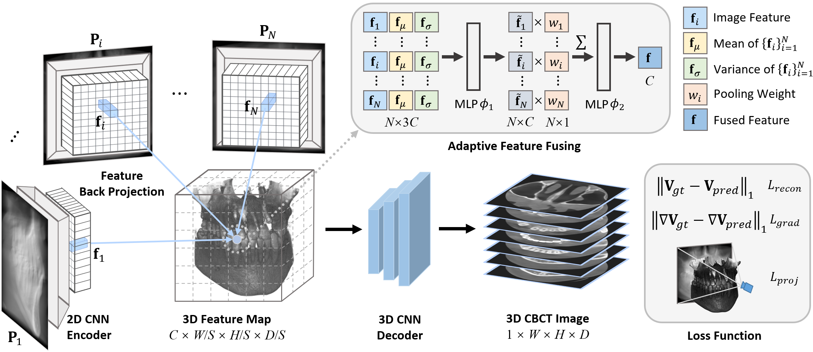
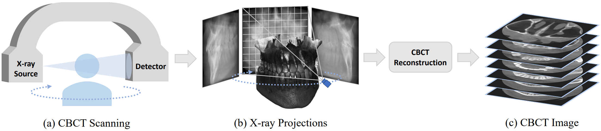

# Geometry-Aware Attenuation Learning for Sparse-View CBCT Reconstruction
[Zhentao Liu](https://zhentao-liu.github.io/), [Yu Fang](https://yuffish.github.io/), [Changjian Li](https://enigma-li.github.io/), [Han Wu](http://hanwu.website/), [Yuan Liu](https://liuyuan-pal.github.io/), [Dinggang Shen](https://idea.bme.shanghaitech.edu.cn/), and [Zhiming Cui](https://shanghaitech-impact.github.io/)

## [Paper](https://ieeexplore.ieee.org/document/10705334) | [Arxiv](https://arxiv.org/abs/2303.14739) | [Dataset](https://huggingface.co/datasets/Zhentao-Liu/TMI2024_SVCT_dataset) | [Project Page](https://shanghaitech-impact.github.io/Geometry-Aware-Attenuation-Learning-for-Sparse-View-CBCT-Reconstruction/)

This is the official repo of our paper **Geometry-Aware Attenuation Learning for Sparse-View CBCT Reconstruction** in **IEEE TMI 2024**. In this work, we describe a novel encoder-decoder framework for sparse-view CBCT reconstruction which integrates the inherent geometry of CBCT scanning system. It produces high quality CBCT reconstructions with sparse input (20 views or less) in a time-efficient manner, which aims to reduce radiation exposure.



## Updated Feature
- **[2024-10-24]** Debugging. We have provided a `if_intersect` function in `models/render.py` that decides whether X-rays intersect with bbx. No more bugs for no intersection in `ray_AABB` function.
- **[2024-10-21]** We have provided a new `angle2vec` function in `models/render.py` that incorporates both `PrimaryAngle` and `SecondaryAngle`, which are commonly used in real-world CBCT scanning system. You may refer to [DICOM Geometry](https://dicom.innolitics.com/ciods/x-ray-angiographic-image/xa-positioner/00181510) for more details about these two angles. And in our paper (DRR simulation for simulated datasets), we only consider about `PrimaryAngle` (rotation angle in our paper), assuming `SecondaryAngle` is set to zero by default. `SecondaryAngle` could also be applied for [Computed Laminography](https://iopscience.iop.org/article/10.1088/1361-6501/aafcae) (CL) imaging as discussed in issue [#2](https://github.com/ShanghaiTech-IMPACT/Geometry-Aware-Attenuation-Learning-for-Sparse-View-CBCT-Reconstruction/issues/2), just setting `SecondaryAngle` as the oblique alpha angle.

## Setup
First clone this repo. And then set up an environment and install packages. We use single A100 80G GPU card for training. Make sure you have enough resources.

    git clone https://github.com/ShanghaiTech-IMPACT/Geometry-Aware-Attenuation-Learning-for-Sparse-View-CBCT-Reconstruction.git
    cd Geometry-Aware-Attenuation-Learning-for-Sparse-View-CBCT-Reconstruction
    conda create -n CBCTrecon python=3.8
    conda activate CBCTrecon
    pip install torch==2.1.2+cu118 torchvision==0.16.2+cu118 --extra-index-url https://download.pytorch.org/whl/cu118
    pip install -r requirements.txt

## Dataset-Preparation

### Dental Dataset (Simulated)
We provide the preprocessed dental CBCT volumes in the dataset link. 130 cases in total, including 100 cases for training, 10 cases for validation, and 20 cases for testing. You may download them, and then put them in a self-built folder `./dataset/dental/raw_volume`. As for X-ray simulation, please refer to [DRR-Simulation](#DRR-Simulation).

### Spine Dataset (Simulated)
As for the spinal dataset, please refer to [CTSpine1K](https://github.com/MIRACLE-Center/CTSpine1K) for more details. We provide the preprocessed spine CT volumes in the dataset link. 130 cases in total, including 100 cases for training, 10 cases for validation, and 20 cases for testing. You may download them, and then put them in a self-built folder `./dataset/spine/raw_volume`. As for X-ray simulation, please refer to [DRR-Simulation](#DRR-Simulation).
### Walnut Dataset (Real-World)
As for the walnut dataset, please refer to [WalnutScan](https://github.com/cicwi/WalnutReconstructionCodes) for more details. It is a large-scale real-world walnut CBCT scans dataset collected for machine learning purpose. Many thanks to this great work. We provide the preprocessed walnut CBCT volumes, real-world projections, and geometry description files in the dataset link. 42 cases in total, including 32 cases for training, 5 cases for validation, and 5 cases for testing. You may download them, and then put them in a self-built folder `./dataset/walnut`.

The dataset split is set as default in `./data/dataset_split`. All datasets have been uploaded to [Hugging Face](https://huggingface.co/datasets/Zhentao-Liu/TMI2024_SVCT_dataset).

## DRR-Simulation



In our experiments, we apply Digitally Reconstructed Radiography (DRR) technique to simulate 2D X-ray projections of given 3D CBCT/CT volumes from dental/spine dataset. You need to first prepare your datasets as instructed in [Dataset-Preparation](#Dataset-Preparation). Then, run the following command.

    # for dental dataset
    python DRR_simulation.py --start=0 --end=360 --num=360 --sad=500 --sid=700 --datapath=./dataset/dental
    # for spine dataset
    python DRR_simulation.py --start=0 --end=360 --num=360 --sad=1000 --sid=1500 --datapath=./dataset/spine

In this way, you will get a data folder `./dataset/dental/syn_data` or `./dataset/spine/syn_data` that containing synthesized X-ray projections and geometry description files for each scanned object. It will generate 360 projections uniformly spaced within the angle range of [0, 360).

## Train
After preparing the dataset and X-ray simulation, you could run the following command to train your model.

    python train.py -n=<Expname> -D=./dataset/dental/syn_data --datatype=dental --train_scale=4 --fusion=ada --start=0 --end=360 --nviews=20 --angle_sampling=uniform --is_train 

In this way, you would train a model with 20 input views uniformly spaced within [0, 360) on dental dataset. The downsampling rate during training S=4, and it adopts adaptive feature fusing strategy proposed in our paper. Other hyperparameters are set as default. You may modify these hyperparamters to train your own model. The training process may take about 20 hours until convergence.

### Transfer the pCT-pretrained decoder into the full model

The decoder pretrainer under `submodel/decoder` saves both `decoder` and
`feature_stem` state dictionaries. During full-model training, `decoder` initializes
the reconstruction decoder, while the frozen `feature_stem` acts as a training-only
teacher:

```text
pCT/GT (ZYX) -> transpose to XYZ -> average pooling x4 -> frozen feature_stem -> z_prior
projections -> 2D encoder -> geometric backprojection -> view fusion             -> z_projection
                                                                               latent alignment
z_projection -> pretrained 3D decoder -> reconstructed volume
```

The teacher is not part of inference. The full model is trained in three stages:

1. Freeze the complete decoder and align the projection latent with the pCT latent.
2. Unfreeze the complete decoder and jointly fine-tune it at a lower learning rate.
3. Freeze the low-resolution decoder body and focus on the final upsampling block
   plus output block. The encoder/aggregator use a very small learning rate by default.

Example for 100 total epochs (15 + 65 + 20):

```bash
python train.py \
  --name dental_prior_transfer \
  --datadir ./dataset/dental/syn_data \
  --datatype dental \
  --train_scale 4 \
  --fusion ada \
  --start 0 \
  --end 360 \
  --nviews 20 \
  --angle_sampling uniform \
  --is_train \
  --epochs 100 \
  --pretrained_decoder submodel/decoder/checkpoints/dental_batch3/ckpt_best_val.pt \
  --latent_lambda 0.1 \
  --latent_cosine_lambda 0.1 \
  --stage1_epochs 15 \
  --stage2_epochs 65 \
  --decoder_lr_factor 0.1 \
  --stage3_backbone_lr_factor 0.01 \
  --soft_lambda 0.5 \
  --soft_window_low -160 \
  --soft_window_high 240
```

The original full model currently supports object batch size 1; `--batch_size 3`
from decoder-only pretraining must not be reused here. It is separate from the number
of projection views selected by `--nviews`.

New arguments:

| Argument | Default | Meaning |
|---|---:|---|
| `--pretrained_decoder` | none | Decoder-pretraining checkpoint with `decoder` and `feature_stem` keys. Supplying it activates staged transfer training. |
| `--latent_lambda` | `0.0` | Stage-1 normalized latent loss weight. The stage-2 weight starts at half this value and linearly falls to zero; stage 3 disables it. |
| `--latent_cosine_lambda` | `0.1` | Weight of the cosine-distance term inside latent alignment. |
| `--stage1_epochs` | `15` | Initial epochs with the complete decoder frozen. |
| `--stage2_epochs` | `65` | Following epochs for full joint fine-tuning. Remaining `--epochs` are stage 3. |
| `--decoder_lr_factor` | `0.1` | Decoder LR relative to the base encoder/aggregator LR. |
| `--stage3_backbone_lr_factor` | `0.01` | Encoder/aggregator LR factor in stage 3. Set it to `0` to freeze them completely. |
| `--soft_lambda` | `0.0` | Additional soft-tissue-window L1 weight. The original attenuation L1 remains active. |
| `--soft_window_low` | `-160` | Lower HU boundary of the soft-tissue window. |
| `--soft_window_high` | `240` | Upper HU boundary of the soft-tissue window. |

The soft-tissue loss is an additional normalized HU-window loss; it does not replace
the original attenuation-space L1, gradient loss, or projection loss. This keeps bone
and global attenuation constrained while increasing sensitivity to low-contrast tissue.

### TensorBoard for full-model training

Events are written to:

```text
train/logs/<experiment-name>/tensorboard/
```

Launch TensorBoard with:

```bash
tensorboard --logdir train/logs/dental_prior_transfer/tensorboard --port 6006
```

Step-level training scalars include total loss, every component, latent weight,
training stage, and the learning rate of each parameter group. Epoch-level `train`,
`val`, and `test` scalars include:

```text
G_loss                    weighted total
mse_loss_3d               attenuation-space voxel L1
gd1_loss                  first-order spatial-gradient L1
mse_loss_2d               projection-domain L1
latent_loss               weighted latent alignment
latent_smooth_l1_raw      unweighted normalized latent Smooth L1
latent_cosine_raw         unweighted latent cosine distance
soft_tissue_loss          weighted normalized HU-window L1
psnr_3d_clamp
ssim_3d_clamp             validation/test only
```

Validation and test projection losses use fixed uniformly spaced detector samples,
so their logged values are repeatable rather than changing with random ray indices.

### Resume transfer training

Resume the latest full checkpoint with the same stage arguments and pretrained path:

```bash
python train.py \
  --name dental_prior_transfer \
  --datadir ./dataset/dental/syn_data \
  --datatype dental \
  --is_train \
  --resume \
  --epochs 100 \
  --pretrained_decoder submodel/decoder/checkpoints/dental_batch3/ckpt_best_val.pt \
  --latent_lambda 0.1 \
  --stage1_epochs 15 \
  --stage2_epochs 65 \
  --soft_lambda 0.5
```

`--resume` restores the full model, optimizer, scheduler, epoch, and global TensorBoard
step. It does not overwrite the resumed decoder with the standalone pretrained weights.

## Evaluate
Once the above training converged, you could run the following command to evaluate your model on test dataset.

    python evaluate.py -n=<Expname> -D=./dataset/dental/syn_data --datatype=dental --train_scale=4 --fusion=ada --start=0 --end=360 --nviews=20 --angle_sampling=uniform --eval_scale=4 --resume_name=200

In this way, it would test the model with 20 input views uniformly spaced within [0, 360) on dental dataset. The downsampling rate during evaluation S=4. Resumed from 200 epoch. You may modify these hyperparameters to evaluate your own model.

You can also take a quick verification with the pretrained weights. Just find them in the [Hugging Face](https://huggingface.co/datasets/Zhentao-Liu/TMI2024_SVCT_dataset).

For a transferred model, inference uses the normal full-model checkpoint and does not
load `feature_stem` or require pCT:

```bash
python evaluate.py \
  --name dental_prior_transfer \
  --datadir ./dataset/dental/syn_data \
  --datatype dental \
  --train_scale 4 \
  --eval_scale 4 \
  --fusion ada \
  --start 0 \
  --end 360 \
  --nviews 20 \
  --angle_sampling uniform \
  --resume_name 99
```

This loads `train/checkpoints/dental_prior_transfer/ckpt_history/ckpt_99`.

## Related Links
- Vector-based CBCT scanning geometry description (source, detector, uvector, vvector) is inspired by [WalnutScan](https://github.com/cicwi/WalnutReconstructionCodes) and [Astra-toolbox](https://github.com/astra-toolbox/astra-toolbox).
- Parts of our code are adapted from [PixelNeRF](https://github.com/sxyu/pixel-nerf) implementation.
- Pioneer NeRF-based framework for CBCT reconstruction: [NAF](https://github.com/Ruyi-Zha/naf_cbct), [SNAF](https://arxiv.org/abs/2211.17048).
- Check the concurrent work [DIF-Net](https://github.com/xmed-lab/DIF-Net) and its improvement [C2RV](https://github.com/xmed-lab/C2RV-CBCT) which also combine feature backprojection and generalization ability to solve sparse-view CBCT reconstruction as we do.
- It is recommended to observe medical data in nii format with [ITK-SNAP](http://www.itksnap.org/pmwiki/pmwiki.php/) or [3D Slicer](https://www.slicer.org/).

Thanks to all these great works.

## Contact
There may be some errors during code cleaning. If you have any questions on our code or our paper, please feel free to contact with the author: liuzht2022@shanghaitech.edu.cn, or raise an issue in this repo. We shall continue to update this repo. TBC.

## Citation
If you find this work is useful for you, please cite our paper.

    @ARTICLE{SVCT,
          author={Liu, Zhentao and Fang, Yu and Li, Changjian and Wu, Han and Liu, Yuan and Shen, Dinggang and Cui, Zhiming},
          journal={IEEE Transactions on Medical Imaging}, 
          title={Geometry-Aware Attenuation Learning for Sparse-View CBCT Reconstruction}, 
          year={2024},
          doi={10.1109/TMI.2024.3473970}
    }
