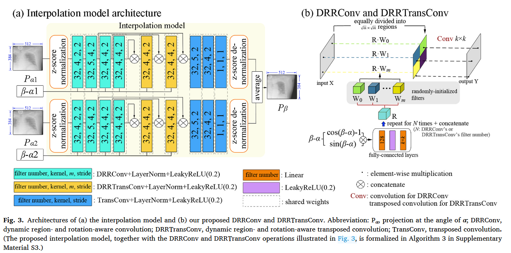

# 插值模型（Fig. 3）说明文档

> 依据论文：J. Zhang and L. Ren, *"Enhance four-dimensional cone-beam computed
> tomography (4D-CBCT) from sparse view acquisitions using a novel deep learning
> model"*, Biomedical Signal Processing and Control 119 (2026) 109935 的 **Fig. 3** 整理。



## 1. 模型概述

- **Fig. 3(a)**：插值模型（Interpolation model），以 U-Net 为骨干。
  - 编码器（Encoder）使用 `DRRConv` 下采样；
  - 解码器（Decoder）使用 `DRRTransConv` 与普通 `TransConv` 上采样；
  - 每个卷积块后接 **LayerNorm + LeakyReLU(0.2)**。
- **Fig. 3(b)**：`DRRConv` / `DRRTransConv` 的内部结构。
  - 输入特征图被**等分成 m 个区域**（equally divided into regions）；
  - 每个区域使用一套**随机初始化**的滤波器 `W0 … Wm`；
  - 全连接层根据角距离生成**调节器 R**，与各区域滤波器**逐元素相乘**；
  - 经过区域卷积 `Conv k×k` 后 **concatenate** 得到输出。

## 2. 输入 / 输出

| 项 | 内容 |
|---|---|
| 输入投影 | 两张相邻投影 `Pα1`、`Pα2`，尺寸 512 × 384 |
| 输入角度 | 角距离 `β - α1`、`β - α2` |
| 输出 | 插值投影 `Pβ`，尺寸 512 × 384（单通道） |

> 两张投影在通道维拼接后送入同一网络（并非两个共享权重的分支）。

## 3. 图中标注格式与参数含义

图中每个卷积块用方括号标注，格式为：

- `DRRConv` / `DRRTransConv`：`[filter number; kernel, m, stride]`
- 普通 `Conv` / `TransConv`：`[filter number; kernel, stride]`

各参数含义：

| 参数 | 含义 |
|---|---|
| `filter number` | **输出通道数**（该层滤波器个数），不是空间切块数 |
| `kernel` | 方形卷积核边长 `k`（即 `k×k`） |
| `m` | **空间区域个数**：把特征图等分成 `m` 个子区域，每个区域各用一套滤波器（仅 DRRConv/DRRTransConv 有） |
| `stride` | 步长：Encoder 中用于下采样，Decoder 中用于上采样 |

> 关键区分：`filter number` 是**通道维**（多少张输出特征图），`m` 是**空间维**（分几块）。
> 一个 DRRConv 层真正占用的卷积核总数 = `filter number × m`。

## 4. 参数配置

### 4.1 表格

| 位置 | 模块 | 图中标注 | 滤波器数 | 卷积核 | 区域数 m | 步长 |
|---|---|---|---|---|---|---|
| Encoder | `DRRConv` | `32, 4, 2, 2` | 32 | 4×4 | 2 | 2 |
| Decoder（黄色） | `DRRTransConv` | `32, 4, 4, 2` | 32 | 4×4 | 4 | 2 |
| Decoder | `TransConv` | `32, 5, 2` | 32 | 5×5 | — | 2 |
| 输出层 | `Conv` | `1, 1, 1` | 1 | 1×1 | — | 1 |

### 4.2 纯文本配置

```text
[插值模型参数配置]
输入投影: 2 张, 512 × 384
输出投影: 1 张, 512 × 384

Encoder  DRRConv        [32; 4, 2, 2]  -> 32 个滤波器, 4×4 核, m=2 区域, 步长 2
Decoder  DRRTransConv   [32; 4, 4, 2]  -> 32 个滤波器, 4×4 核, m=4 区域, 步长 2
Decoder  TransConv      [32; 5, 2]     -> 32 个滤波器, 5×5 核, 步长 2
输出层    Conv           [1; 1, 1]      -> 1 个滤波器, 1×1 核, 步长 1

每个卷积块之后: LayerNorm + LeakyReLU(0.2)
角距离编码: cos(β-α)-1, sin(β-α) -> Linear -> LeakyReLU(0.2) -> Linear (shared weights)
```

## 5. 各模块细节

### 5.1 卷积块

每个卷积块统一为 `卷积 + LayerNorm + LeakyReLU(0.2)`：

- `DRRConv + LayerNorm + LeakyReLU(0.2)`
- `DRRTransConv + LayerNorm + LeakyReLU(0.2)`
- `TransConv + LayerNorm + LeakyReLU(0.2)`

其中 LayerNorm 对 (C, H, W) 做归一化，使特征表示不受输入分布影响（论文 2.2.1）。

### 5.2 角距离编码与调节器（rotation-aware）

角距离 `β - α` 先经以下编码：

```text
cos(β - α) - 1 ,  sin(β - α)
```

再经全连接层 `Linear → LeakyReLU(0.2) → Linear` 生成**调节器 R**。图中标注这些全连接层为 **shared weights**（共享权重）。调节器 R 与各区域滤波器逐元素相乘，使权重随角距离动态调整——即「根据角度自适应组合 Pα1 与 Pα2」。

### 5.3 DRRConv / DRRTransConv 内部（Fig. 3b）

```text
输入 X
  └─ 等分成 m 个区域
        │
        ├─ 区域 0: W0 (随机初始化) × R ─ Conv k×k ─┐
        ├─ 区域 1: W1 (随机初始化) × R ─ Conv k×k ─┼─ concatenate ─ 输出 Y
        └─ ...                                    ┘
```

- 滤波器 `W0 … Wm` 是**随机初始化、直接学习**的（区别于 DRConv 由输入内容生成滤波器）；
- `R` 来自全连接层（rotation-aware）；
- `Conv k×k` 是普通卷积（DRRConv）或普通转置卷积 `TransConv`（DRRTransConv）。

## 6. 与代码（`src/fig3.py`）的对应关系

| 图中标注 | 代码参数 | 说明 |
|---|---|---|
| `filter number` | `out_channels` | 输出通道数 |
| `kernel` | `kernel_size` | 方形卷积核边长 |
| `m` | `num_regions` | 区域个数（构造函数参数，可配置，默认 4） |
| `stride` | `stride` | 步长 |
| 角距离 `β-α` | `angular` | 输入张量 `(B, angular_dim)` |
| 区域划分 | `guide_mask` | 可学习软掩码（图中为「等分」） |
| LayerNorm | `nn.GroupNorm(1, C)` | 等价于 2D 的 LayerNorm |
| 激活 | `nn.ReLU` | ⚠️ 图中为 `LeakyReLU(0.2)`，代码需对齐 |

> 备注：`src/fig3.py` 当前实现与图中标注存在以下待对齐项——激活函数（ReLU → LeakyReLU(0.2)）、
> Encoder/Decoder 的 `m`（默认 4 → 图中 2/4）、区域划分方式（可学习软掩码 → 等分）。

## 7. 训练

真实数据训练脚本：`src/train_interpolation.py`，配置文件：`config/config.json`。

### 7.1 采样策略

每个病例、每个 epoch：

- 随机选 `rotors_per_case = 6` 个**转子**（6 个跨 360° 等距视角）；
- 每个转子的 6 个相邻视角之间**各取 1 个目标角**（共 6 个目标）；
- 每个病例每 epoch 共 `6 × 6 = 36` 个训练步。

### 7.2 损失

- **必选**：`1 - SSIM + α·L_VGG`（VGG19 感知损失，论文 Eq.1；`α` 见 config `loss.alpha`）；
- **可选**：视图选择/旋转一致性损失（`--consistency`，权重 `loss.lambda_consistency`）；
- 全部在**原始值域**（0~255）上计算，`L = 255`（模型已做输入 z-score + 输出反归一化）。

> ⚠️ 一致性损失会让每个目标多一次前向（两张计算图），显存近乎翻倍；320×1280 下建议先 resize 到 512×384 再开启。

### 7.3 运行命令

日志自动写入 `logs/{version}_{data_name}_fv{final_view}`，区分版本、器官与视角数：

```bash
conda activate deeplearning

# thorax，v1 版本，6 个输入视角（config 默认 data_name=thorax）
python src/train_interpolation.py --version v1 --final_view 6

# head 器官，v1 版本，6 个输入视角
python src/train_interpolation.py --data_name head --version v1 --final_view 6

# 冒烟测试：只跑 3 步
python src/train_interpolation.py --version v1 --final_view 6 --max_steps 3 --zscore_max_cases 2

# 指定训练轮数
python src/train_interpolation.py --version v1 --final_view 6 --epochs 500

# 从最新断点继续训练（用同一个 --version / --data_name / --final_view）
python src/train_interpolation.py --version v1 --final_view 6 --resume

# 开启一致性损失（可选）
python src/train_interpolation.py --version v1 --final_view 6 --consistency --lambda_consistency 1.0

# 推理：给定目标角度预测投影
python src/inference.py --checkpoint logs/v1_thorax_fv6/checkpoints/interpolation_epoch10.pt \
    --case 2026-06-04_065713 --target_angle 30.5

# 查看 TensorBoard 日志
tensorboard --logdir logs
```

常用命令行参数：

| 参数 | 说明 |
|---|---|
| `--version v1` | 版本号，写入日志目录名 |
| `--data_name thorax` | 数据/器官名（thorax、head…），决定数据路径与日志目录名 |
| `--final_view 6` | 输入投影数（覆盖 config 的 `model.in_channels`） |
| `--amp` / `--no_amp` | 开 / 关混合精度（默认读 config 的 `training.amp`） |
| `--alpha` | VGG 感知损失权重（默认读 config 的 `loss.alpha`） |
| `--consistency` | 开启可选的一致性损失 |
| `--lambda_consistency` | 一致性损失权重（默认读 config 的 `loss.lambda_consistency`） |
| `--epochs` | 覆盖训练轮数 |
| `--clip_grad` | 梯度范数裁剪阈值（0 关闭；默认读 config 的 `training.clip_grad_norm`） |
| `--resume` | 从 run 的 checkpoints 目录里加载最新断点继续训练 |
| `--max_steps` | 只跑 N 步（冒烟测试） |
| `--max_cases` | 每 epoch 限制病例数（冒烟测试） |
| `--min_views` | 丢弃视角数少于 N 的病例（自动跳过缺失 pickle / 视角过少的样本） |
| `--eval_split` | 每个 epoch 验证用的 split（默认 `eval`；传空串关闭验证） |
| `--eval_every` | 每 N 个 epoch 验证一次（默认读 config 的 `logging.eval_every_epochs`） |
| `--eval_rotors` | 验证时每个病例的转子数（默认 = `rotors_per_case`） |
| `--zscore_max_cases` | z-score 统计量扫描的病例数 |
| `--device` | `cuda` / `cpu` |

### 7.4 配置文件 `config/config.json`

| 键 | 说明 |
|---|---|
| `data_name` | 默认数据名（如 `thorax`） |
| `data_roots` | 各数据名对应的**候选路径列表**（自动取第一个存在的，支持 `~` 展开） |
| `model` | `in_channels`（源投影数）、`base_channels`、`num_down`、`num_regions` |
| `training` | `epochs`、`lr`、`rotors_per_case`、`use_cos_sin`、`amp`、`seed`、`zscore_max_cases`、`min_views`、`clip_grad_norm` |
| `loss` | `ssim_window`、`val_range`（=255）、`alpha`、`lambda_consistency`、`vgg_feature_layers`、`vgg_weights` |
| `logging` | `log_every_steps`、`checkpoint_every_epochs`、`eval_every_epochs` |

> 训练与推理统一从 `config/config.json` 读取 `data_name` / `data_roots` 等配置。

### 7.5 推理

`src/inference.py`：加载 checkpoint（模型权重 + z-score 统计量 + config），对指定病例和目标角度做插值预测，输出 `.npy` / `.png`。

```bash
conda activate deeplearning
python src/inference.py \
    --checkpoint logs/v1_thorax_fv6/checkpoints/interpolation_epoch10.pt \
    --case 2026-06-04_065713 \
    --target_angle 30.5
```

| 参数 | 说明 |
|---|---|
| `--checkpoint` | 训练保存的 `.pt` 文件路径 |
| `--case` | 病例 id |
| `--target_angle` | 目标投影角度（度） |
| `--num_inputs` | 源视角数（默认取 checkpoint 的 `final_view`） |
| `--out_dir` | 输出目录（默认 `inference_results/`） |
